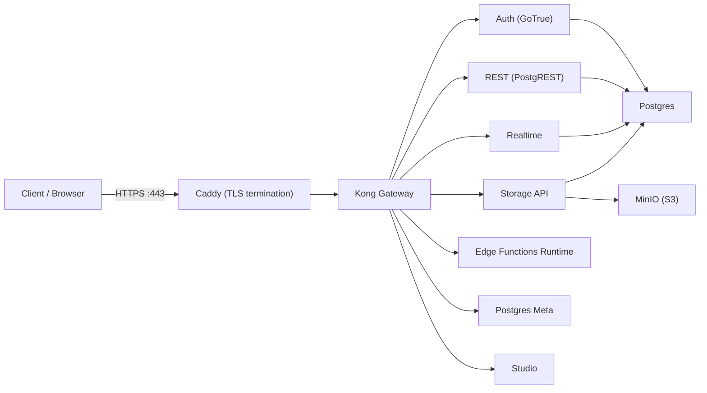

# Supabase Deploy (Self-Hosted)

[](https://github.com/Gouryella/supabase-deploy)
[](https://github.com/Gouryella/supabase-deploy)
[](https://docs.docker.com/compose/)
[](https://www.gnu.org/software/bash/)

Bring up a full Supabase stack with Docker Compose — but with the part you actually care about done right: **a single automated script** that generates keys, renders configs, orchestrates startup, and waits until the system is truly ready.

## Description
`Gouryella/supabase-deploy` is a minimal, production-minded Supabase self-hosted setup built around `deploy.sh` — an idempotent deployment script that:
- generates/updates `.env` secrets (including real JWTs for ANON / SERVICE ROLE keys)
- renders Kong declarative config from a template
- starts services in the correct order with readiness checks
- initializes the required Postgres roles/schemas and the MinIO storage bucket

If you want “clone → run one command → get a working Supabase”, this repo is for you.

## Why You’ll Like This Repo
- **One entry point:** `./deploy.sh` handles config + startup end-to-end.
- **Safe-by-default networking:** HTTP services bind to `127.0.0.1`; you expose only what you intend (typically via Caddy on 80/443).
- **Repeatable upgrades:** re-run the script to recreate config, refresh containers, and keep credentials in sync.
- **Practical defaults:** Kong is pre-wired for Auth, REST, Realtime, Storage, Functions, Meta, and Studio.
- **Low-memory friendly:** no bundled analytics/logging stack, and you can start only the services you need (keep Studio/Functions optional).

## Quick Start
1. One-command deploy (auto-install Docker, auto-download compose/kong template, then deploy):
   ```bash
   curl -fsSL https://raw.githubusercontent.com/Gouryella/supabase-deploy/main/install.sh | bash
   ```
2. Set your domain in `/root/supabase-deploy/Caddyfile` (or `$HOME/supabase-deploy/Caddyfile` if not root), then rerun:
   ```bash
   bash /root/supabase-deploy/deploy.sh
   ```
3. Open Studio:
   - `https://<your-domain>/`

### Optional Flags
```bash
# Force container recreation
curl -fsSL https://raw.githubusercontent.com/Gouryella/supabase-deploy/main/install.sh | bash -s -- --recreate

# Custom install path
curl -fsSL https://raw.githubusercontent.com/Gouryella/supabase-deploy/main/install.sh | INSTALL_DIR=/opt/supabase bash
```

## Prerequisites
- Linux host with `curl` (Docker is auto-installed by `install.sh` if missing)
- `openssl`
- `python3` or `envsubst` (used to render `config/kong.yml`)
- Caddy (recommended) or any reverse proxy you prefer

## Low-Memory Deployment
This is still **a real Supabase stack** (multiple containers), so memory usage depends on traffic and which components you run. That said, this repo is designed to be friendly to small VPS setups:
- Studio analytics/logging are disabled by default (`ANALYTICS_ENABLED=false`, `NEXT_PUBLIC_ENABLE_LOGS=false`).
- You can deploy config once, then start a **minimal service set** and add heavier components only when needed.

### Minimal Mode (No Studio / No Functions)
Generate config and secrets first:
```bash
./deploy.sh --config-only
```

Start only the core APIs behind Kong:
```bash
docker compose up -d \
  db minio \
  auth rest realtime storage imgproxy meta \
  kong
```

Optional (only if you need connection pooling):
```bash
docker compose up -d pgbouncer
```

### Add “Nice-to-Have” Services On Demand
Bring up Studio only when you actually need the UI:
```bash
docker compose up -d studio
```

Bring up Edge Functions only when you need them:
```bash
docker compose up -d functions
```

### Extra RAM-Saving Tips
- If you don’t need image transformation, set `ENABLE_IMAGE_TRANSFORMATION=false` for `storage` and stop `imgproxy`.
- On tiny VPSes, enabling swap can help avoid OOM kills during cold starts.

## What `deploy.sh` Actually Automates
`deploy.sh` is not a thin wrapper around `docker compose up`.

It performs the kind of glue-work you usually end up doing by hand:
- Generates `.env` (preserves existing values; fills missing ones)
- Generates `ANON_KEY` and `SERVICE_ROLE_KEY` as **JWTs** signed by `JWT_SECRET`
- Renders `config/kong.yml` from `config/kong.yml.template`
- Starts Postgres + MinIO first, then waits for readiness
- Waits for Supabase initialization roles to exist (`supabase_auth_admin`, `supabase_storage_admin`)
- Creates the `_supabase` database and `_realtime` schema if missing
- Syncs service account passwords when `POSTGRES_PASSWORD` changes
- Creates the `supabase-storage` bucket in MinIO
- Starts the full stack and prints access info

## Architecture (High-Level)


## Services & Local Ports
Most service ports are bound to `127.0.0.1` (loopback) unless noted otherwise.

| Service | Container | Local Port | Notes |
|---|---:|---:|---|
| Postgres | `supabase-db` | `13732` | direct DB access (binds to all interfaces by default; consider restricting to `127.0.0.1`) |
| Auth | `supabase-auth` | `13799` | internal via Kong |
| REST | `supabase-rest` | `13730` | internal via Kong |
| Realtime | `supabase-realtime` | `13740` | internal via Kong |
| DB Pooler | `supabase-pgbouncer` | `13743` | PgBouncer |
| Storage | `supabase-storage` | `13750` | internal via Kong |
| Imgproxy | `supabase-imgproxy` | `13751` | used by Storage |
| Meta | `supabase-meta` | `13760` | internal via Kong |
| MinIO | `supabase-minio` | `13790` | S3 API |
| MinIO Console | `supabase-minio` | `13791` | admin UI |
| Kong | `supabase-kong` | `13780` | reverse proxy target |
| Functions | `supabase-functions` | `13792` | internal via Kong |
| Studio | `supabase-studio` | `13731` | internal via Caddy → Kong |

## Script Options
```bash
./deploy.sh --config-only   # generate .env + kong.yml, do not start services
./deploy.sh --recreate      # force recreate all containers
```

## Configuration
- `.env` is generated automatically and contains secrets + service keys.
- `config/kong.yml` is generated from `config/kong.yml.template` (edit the template, not the output).
- `functions/` is mounted into the Edge Functions container.

Important values:
- `SUPABASE_PUBLIC_DOMAIN` (used for Studio URLs and GoTrue site URL)
- `JWT_SECRET`, `ANON_KEY`, `SERVICE_ROLE_KEY`
- `POSTGRES_PASSWORD`, `MINIO_ROOT_PASSWORD`

## Caddy (TLS + Reverse Proxy)
`Caddyfile` proxies your public domain to Kong:
```caddyfile
example.com {
  encode zstd gzip
  reverse_proxy http://127.0.0.1:13780
}
```

To get HTTPS certificates:
- Ensure DNS points to your server
- Ensure ports `80` and `443` are reachable from the internet

## Useful Commands
```bash
docker compose ps
docker compose logs -f
docker compose restart <service>
docker compose down
```

## Troubleshooting
- **Deploy script times out waiting for roles:** check `docker compose logs --tail=200 db` and consider increasing `ROLE_WAIT_SECONDS`.
- **Caddy cannot issue certificates:** verify DNS and open ports 80/443; confirm the domain in `Caddyfile`.
- **Studio loads but API calls fail:** confirm `SUPABASE_PUBLIC_DOMAIN` is correct and restart the stack.

## Security Notes
- Treat `.env` as sensitive and never commit it.
- Keep everything loopback-bound (default); expose only via a reverse proxy.
- Rotate keys and passwords if you suspect they were exposed.

## Production Hardening (Recommended)
- Restrict Postgres to localhost by changing the port mapping in `docker-compose.yml`:
  ```diff
  - "13732:5432"
  + "127.0.0.1:13732:5432"
  ```
- Put a firewall in front of the host and expose only `80/443`.

---
If this repo saves you time, consider starring it on GitHub.
